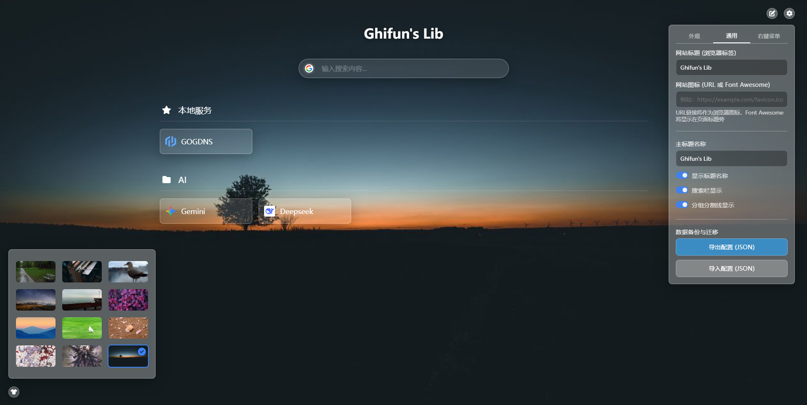

# GVia - 个人导航页面

一个简洁优雅的个人导航页面系统，基于 Go + Echo 框架开发，支持动态配置和实时更新。

<div align="center">
  
</div>

## 功能特性

- 📚 **链接分组管理** - 支持将书签按分组管理，自定义图标和描述
- 🔍 **搜索引擎集成** - 支持百度等多种搜索引擎
- 🎨 **自定义壁纸** - 支持设置背景壁纸，内置多张精美壁纸
- ⚙️ **动态配置** - 通过 API 动态修改配置，实时生效（SSE 推送）
- 📱 **响应式设计** - 适配各种屏幕尺寸
- 🚀 **单文件部署** - 支持将静态资源编译到二进制文件中
- 🔗 **右键快捷菜单** - 支持自定义右键菜单快捷方式

## 项目结构

```
GVia/
├── main.go              # 主程序入口
├── config.json          # 配置文件
├── go.mod               # Go 模块依赖
├── www/                 # 前端静态资源
│   ├── index.html       # 主页面
│   ├── css/             # 样式文件
│   ├── js/              # JavaScript 脚本
│   ├── font/            # 字体文件
│   └── wallpaper/       # 壁纸图片
└── websource/           # 编译后的静态资源（用于嵌入）
```

## 配置说明

配置文件 `config.json` 支持以下选项：

| 配置项 | 类型 | 说明 |
|--------|------|------|
| `siteTitle` | string | 网站标题 |
| `searchTitle` | string | 搜索框标题 |
| `searchEngine` | string | 默认搜索引擎（如 baidu） |
| `wallpaper` | string | 背景壁纸路径 |
| `showTitle` | boolean | 是否显示标题 |
| `showSearch` | boolean | 是否显示搜索框 |
| `showGroupDivider` | boolean | 是否显示分组分隔线 |
| `bgBlur` | string | 背景模糊度 |
| `blur` | string | 内容模糊度 |
| `groups` | array | 链接分组配置 |
| `contextMenu` | array | 右键菜单配置 |

### 分组配置示例

```json
{
  "groups": [
    {
      "title": "常用工具",
      "icon": "fas fa-star",
      "id": "g-001",
      "links": [
        {
          "title": "GitHub",
          "url": "https://github.com",
          "icon": "https://github.com/favicon.ico",
          "desc": "代码托管平台"
        }
      ]
    }
  ]
}
```

## API 接口

| 接口 | 方法 | 说明 |
|------|------|------|
| `/api/config` | GET | 获取当前配置 |
| `/api/config` | POST | 保存配置 |
| `/events` | GET | SSE 实时推送配置更新 |

## 技术栈

- **后端**: Go 1.21 + [Echo v4](https://echo.labstack.com/)
- **前端**: 原生 HTML/CSS/JavaScript
- **图标**: Font Awesome 6
- **实时通信**: Server-Sent Events (SSE)

## 主要依赖

- `github.com/labstack/echo/v4` - Web 框架
- `github.com/elazarl/go-bindata-assetfs` - 静态资源嵌入

## 许可证

MIT License

## 作者

Ghifun

---

⭐ 如果你觉得这个项目有帮助，欢迎 Star！
